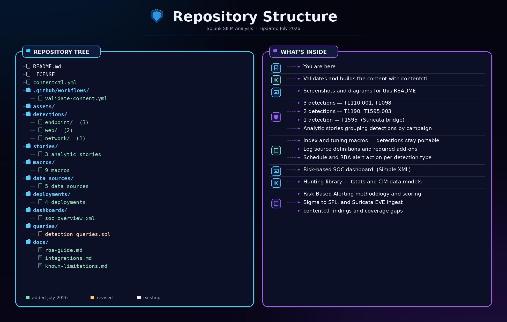

<div align="center">

# 📊 SIEM Threat Detection & Log Analysis with Splunk

### Risk-Based Detection Engineering on 33.4 Million Real Security Events

[](https://www.splunk.com/)
[](https://ubuntu.com/)
[](https://docs.splunk.com/Documentation/Splunk/latest/SearchReference)
[](https://attack.mitre.org/)
[](docs/rba-guide.md)
[](../../actions/workflows/validate-content.yml)

<br>

*A hands-on cybersecurity project demonstrating SIEM operations — from Splunk installation and log ingestion to writing SPL detection queries, building security dashboards, creating alert rules, and investigating a real multi-stage web attack scenario across correlated log sources.*

<br>

[Setup & Ingestion](#part-1---splunk-setup--log-ingestion) · [SPL Fundamentals](#part-2---spl-search-fundamentals) · [Threat Detection](#part-3---threat-detection-queries) · [Dashboards](#part-4---security-monitoring-dashboards) · [Alerts](#part-5---alert-rules--automated-detection) · [Investigation](#part-6---attack-investigation--incident-timeline)

</div>

---

## 📋 Project Overview

A SIEM (Security Information and Event Management) platform is the nerve center of a Security Operations Center. It collects logs from across the environment, correlates events, and enables analysts to detect and investigate threats. This project demonstrates practical SIEM skills using Splunk — the industry-leading platform — working with **33.4 million real security events** from the Boss of the SOC dataset to detect web attacks, privilege changes, and reconstruct an attacker's full activity timeline.

### What This Project Covers

| Section | Skill Demonstrated | Tools Used |
|---|---|---|
| **Setup & Ingestion** | Splunk installation, data inputs, index management | Splunk Enterprise, `inputs.conf` |
| **SPL Fundamentals** | Search Processing Language queries and data exploration | SPL, `stats`, `table`, `timechart` |
| **Threat Detection** | Writing detection queries for real attack patterns | SPL, `where`, `eval`, `search` |
| **Dashboards** | Building operational security monitoring dashboards | Splunk Classic Dashboards |
| **Alert Rules** | Creating automated detection with alert actions | Scheduled searches, triggers |
| **Investigation** | Correlating events to reconstruct an attack timeline | Cross-sourcetype correlation, `timechart` |
| **Risk-Based Alerting** | Scoring entities rather than firing per-detection alerts | Risk data model, `action.risk`, ES 8.x |
| **Detection-as-Code** | Versioned YAML detections compiled and validated in CI | `contentctl`, GitHub Actions |
| **CIM & Acceleration** | Portable detections on normalised data models | `tstats`, Authentication/Web/Change/Intrusion_Detection |
| **Pipeline Integration** | Ingesting sensor output from companion projects | Suricata EVE JSON, Sigma conversion |

---

## 🏗️ Lab Environment

The lab runs Splunk Enterprise on Ubuntu 24.04 inside VirtualBox, analyzing over 33 million security events across 26 different log sources from the Boss of the SOC (BOTS) v1 dataset.

### Architecture

```
+----------------------------------------------------------------+
|                      Splunk SIEM Lab                           |
|                                                                |
|   +----------------------+       +-------------------------+   |
|   |   BOTS v1 Dataset    |       |   Splunk Enterprise     |   |
|   |   (33.4M events)     |       |   (Ubuntu 24.04 VM)     |   |
|   |                      |       |                         |   |
|   |  - Windows Security  | ----> |   Index: botsv1         |   |
|   |  - Fortinet Firewall | ----> |                         |   |
|   |  - Suricata IDS      | ----> |   Source Types: 26      |   |
|   |  - Stream HTTP/TCP   | ----> |                         |   |
|   |  - Sysmon            | ----> |   Time Range: Aug 2016  |   |
|   |  - Stream DNS        | ----> |                         |   |
|   +----------------------+       +-------------------------+   |
+----------------------------------------------------------------+
```

### Log Sources (Top 10 by Event Count)

| Source Type | Event Count | Purpose |
|---|---|---|
| **WinEventLog:Security** | 14,131,490 | Windows authentication, process creation, privilege events |
| **fgt_traffic** | 7,675,023 | Fortinet firewall traffic logs |
| **suricata** | 5,078,376 | IDS/IPS alerts and network detections |
| **stream:tcp** | 1,754,601 | TCP connection metadata |
| **stream:ip** | 1,435,025 | IP-layer packet metadata |
| **stream:dns** | 1,369,998 | DNS query/response records |
| **XmlWinEventLog:Microsoft-Windows-Sysmon/Operational** | 559,792 | Detailed process/network Sysmon telemetry |
| **stream:smb** | 448,008 | SMB file-sharing activity |
| **fgt_utm** | 257,477 | Fortinet UTM security events |
| **stream:http** | 39,010 | HTTP request/response stream data |

> **Data source:** This project uses the [Boss of the SOC (BOTS) v1](https://github.com/splunk/botsv1) dataset — a realistic, labeled attack dataset created by Splunk for security training. It contains a complete web attack scenario targeting a corporate environment, with data captured from August 2016.

### 🎯 Detection Coverage — MITRE ATT&CK Mapping

Every detection carries its ATT&CK technique in structured YAML, so coverage is measurable programmatically rather than read off a table. CI fails any detection missing a technique ID or a risk object.

| Adversary Technique | ATT&CK ID | Tactic | Detection | Risk |
|---|---|---|---|---|
| **Brute Force: Password Guessing** | [T1110.001](https://attack.mitre.org/techniques/T1110/001/) | Credential Access | Excessive Failed Logons From Single Source | 30 / 20 |
| **Brute Force: Password Guessing** | [T1110.001](https://attack.mitre.org/techniques/T1110/001/) | Credential Access | Successful Logon After Failed Logon Burst | 70 |
| **Account Manipulation** | [T1098](https://attack.mitre.org/techniques/T1098/) | Persistence | Privileged Group Membership Change | 40 |
| **Exploit Public-Facing Application** | [T1190](https://attack.mitre.org/techniques/T1190/) | Initial Access | Web SQL Injection Attempt | 60 |
| **Active Scanning: Wordlist Scanning** | [T1595.003](https://attack.mitre.org/techniques/T1595/003/) | Reconnaissance | Web Scanning Via Not Found Responses | 35 |
| **Active Scanning** | [T1595](https://attack.mitre.org/techniques/T1595/) | Reconnaissance | High Severity Suricata IDS Alert | 45 |

### 📂 Repository Structure

<div align="center">

</div>

<br>

<details>
<summary><strong>Text version (click to expand)</strong></summary>

```
.
├── README.md                                  ← You are here
├── LICENSE
├── contentctl.yml                             ← Detection-as-code project config
├── .github/workflows/
│   └── validate-content.yml                   ← CI: contentctl validate + build
├── assets/                                    ← Screenshots referenced in this README
├── detections/                                ← Detection-as-code source of truth
│   ├── endpoint/                              ← 3 detections — T1110.001, T1098
│   ├── web/                                   ← 2 detections — T1190, T1595.003
│   └── network/                               ← 1 detection — T1595 (Suricata bridge)
├── stories/                                   ← 3 analytic stories grouping detections
├── macros/                                    ← 9 macros: index abstraction + tuning filters
├── data_sources/                              ← 5 log source definitions and required add-ons
├── deployments/                               ← Schedule + RBA alert action per detection type
├── dashboards/
│   └── soc_overview.xml                       ← Risk-based SOC dashboard (Simple XML)
├── queries/
│   ├── detection_queries.spl                  ← Hunting library — tstats + CIM data models
│   └── alert_configs.spl                      ← Migration map to the generated savedsearches
└── docs/
    ├── rba-guide.md                           ← Risk-Based Alerting methodology and scoring
    ├── integrations.md                        ← Sigma→SPL and Suricata EVE ingest
    └── known-limitations.md                   ← contentctl findings and coverage gaps
```

</details>

### Building the content

The detections are the source of truth; the Splunk app is generated from them.

```bash
pip install contentctl
contentctl validate     # schema, references, RBA structure
contentctl build        # -> dist/botsv1_soc_detections-latest.tar.gz
```

Install the resulting app on a search head running Splunk Enterprise Security. Both commands run in CI on every push.

---

## Part 1 - Splunk Setup & Log Ingestion

### Installing Splunk Enterprise on Ubuntu

I install Splunk Enterprise on an Ubuntu 24.04 VM:

```bash
# Download the .deb package from splunk.com (requires free account)
sudo dpkg -i splunk.deb

# Start Splunk for the first time and accept the license
sudo /opt/splunk/bin/splunk start --accept-license --answer-yes --run-as-root
```

During the initial start, Splunk prompts for an admin username and password. After starting, the web interface is available at `http://localhost:8000`.

<div align="center">

<br><em>Splunk Enterprise 10.2.2 home screen showing available apps, bookmarks, and common tasks — the starting point for all SIEM operations</em>
</div>

<br>

### Verifying the botsv1 Index

I install the BOTS v1 dataset as a Splunk app by extracting it into `/opt/splunk/etc/apps/`, then restart Splunk to load the index. After restart, I verify the index is loaded and contains data:

```spl
| eventcount summarize=false index=botsv1 | table index, count
```

<div align="center">

<br><em>The botsv1 index loaded with 33,413,777 events — successful data ingestion confirmed</em>
</div>

<br>

### Verifying Data Ingestion Across Source Types

I explore the variety of log sources in the dataset:

```spl
index=botsv1 | stats count by sourcetype | sort -count
```

<div align="center">

<br><em>26 distinct source types ingested — from Windows Security events (14.1M) and Fortinet firewall logs (7.6M) to Suricata IDS alerts (5M) and stream data across multiple protocols</em>
</div>

<br>

---

## Part 2 - SPL Search Fundamentals

### Exploring Windows Security Event Codes

Before hunting for threats, I explore the distribution of Windows Security event codes to understand what activity the dataset captured:

```spl
index=botsv1 sourcetype="WinEventLog:Security"
| stats count by EventCode
| sort -count
| head 20
```

<div align="center">

<br><em>Top Windows EventCodes — 4703 (token rights adjusted), 4689 (process exited), 4688 (process created), and 4624 (successful logon) dominate the dataset, providing rich telemetry for behavioral detections</em>
</div>

<br>

**Key EventCodes identified in the dataset:**

| EventCode | Description | Count | Detection Use |
|---|---|---|---|
| **4703** | Token rights adjusted | 3,034,865 | Privilege manipulation |
| **4689** | Process has exited | 2,577,818 | Process execution tracking |
| **4688** | New process created | 2,575,010 | Execution-based threat hunting |
| **4624** | Account successfully logged on | 407,843 | Authentication monitoring |
| **4634** | Account logged off | 407,595 | Session tracking |
| **4672** | Special privileges assigned | 378,789 | Privilege escalation detection |
| **4656** | Object handle requested | 306,618 | File/registry access monitoring |

### Key SPL Commands Used

| Command | Purpose | Example |
|---|---|---|
| `stats` | Aggregate data | `stats count by src_ip` |
| `table` | Display specific fields | `table _time, user, src_ip` |
| `timechart` | Time-based aggregation | `timechart span=1h count` |
| `where` | Filter with expressions | `where count > 100` |
| `eval` | Create calculated fields | `eval source_type=sourcetype` |
| `search` | Filter with search terms | `search uri_path="*passwd*"` |
| `sort` | Order results | `sort -count` |
| `head` | Limit results | `head 10` |

---

## Part 3 - Threat Detection Queries

### Process Execution Anomaly Detection

Process creation events (EventCode 4688) provide one of the richest sources for threat hunting. I search for the most frequently executed processes to establish a baseline and identify outliers:

```spl
index=botsv1 sourcetype="WinEventLog:Security" EventCode=4688
| stats count AS executions by New_Process_Name
| where executions > 100
| sort -executions
| head 20
```

<div align="center">

<br><em>Process execution baseline — Splunk Universal Forwarder components dominate (expected), while spikes in wmiprvse.exe (45,429), dllhost.exe (9,866), and conhost.exe (9,313) warrant investigation as these are commonly abused by attackers for lateral movement and command execution</em>
</div>

<br>

> **Why this matters:** In real threat hunting, attackers often use legitimate Windows binaries ("living-off-the-land") to evade detection. Establishing execution baselines lets analysts spot anomalous spikes that indicate attacker activity — for example, unusually high PowerShell, WMI, or cmd.exe execution rates.

### Web Application Attack Detection

I search the HTTP stream data for common web attack patterns — path traversal, local file inclusion, and remote command execution attempts:

```spl
index=botsv1 sourcetype="stream:http"
| search uri_path="*SELECT*" OR uri_path="*UNION*" OR uri_path="*../*" OR uri_path="*passwd*"
| stats count by src_ip, uri_path
| sort -count
```

<div align="center">

<br><em>Web attack detection revealing a single attacker (40.80.148.42) attempting path traversal, local file inclusion (/etc/passwd, /.htpasswd), and Windows command execution via cgi-bin — using UTF-8 overlong encoding bypass techniques (%C0%AF, %E0%80%AF) to evade web application filters</em>
</div>

<br>

**Attack techniques identified from a single source IP (40.80.148.42):**

| Attack Category | Example Payload | Technique |
|---|---|---|
| **Local File Inclusion** | `/etc/passwd`, `/etc/passwd%00` | Null-byte injection for path bypass |
| **Credential File Access** | `/.htpasswd`, `/.passwd` | Sensitive file enumeration |
| **Remote Command Execution** | `/cgi-bin/../../winnt/system32/cmd.exe` | Classic IIS directory traversal |
| **Encoding Bypass** | `%C0%AF`, `%E0%80%AF` | UTF-8 overlong encoding |
| **Application Targeting** | `/vti_bin/`, `/samples/`, `/scripts/` | Known-vulnerable path probing |

This single scan identified **40.80.148.42** as the primary attacker — an IP that becomes the focus of the Part 6 investigation.

---

## Part 4 - Security Monitoring Dashboards

### Building the SOC Overview Dashboard

I build a four-panel security monitoring dashboard that gives an analyst immediate visibility into key security indicators:

<div align="center">

<br><em>SOC Security Overview dashboard showing process creation trends, top web attackers (with 40.80.148.42 dominating at ~17K requests), most-executed processes, and top accounts by activity — combining multiple data sources into a single analyst view</em>
</div>

<br>

**Dashboard panels:**

**Panel 1 — Process Creations Over Time (Line Chart):**

```spl
index=botsv1 sourcetype="WinEventLog:Security" EventCode=4688
| timechart span=1h count AS "Process Creations"
```

**Panel 2 — Top Source IPs Hitting Web Server (Bar Chart):**

```spl
index=botsv1 sourcetype="stream:http"
| stats count by src_ip
| sort -count
| head 10
```

**Panel 3 — Top Processes Executed (Bar Chart):**

```spl
index=botsv1 sourcetype="WinEventLog:Security" EventCode=4688
| stats count by New_Process_Name
| sort -count
| head 15
```

**Panel 4 — Top Accounts by Activity (Bar Chart):**

```spl
index=botsv1 sourcetype="WinEventLog:Security" EventCode=4688
| stats count by Account_Name
| sort -count
| head 10
```

### Geolocation Panel

I add a geographic analysis panel showing the countries and cities of web requests hitting the server:

```spl
index=botsv1 sourcetype="stream:http"
| iplocation src_ip
| where isnotnull(Country)
| stats count by Country, City
| sort -count
| head 20
```

<div align="center">

<br><em>Geolocation analysis revealing Washington, D.C. as the top source of web traffic (17,547 requests) — traced to the attacker IP 40.80.148.42 — followed by Ashburn, Oakland, and other U.S. cities</em>
</div>

<br>

> **Why dashboards matter:** In a real SOC, analysts monitor dashboards continuously during their shifts. A well-designed dashboard surfaces anomalies immediately — the dominance of a single IP in the "Top Source IPs" panel (40.80.148.42 at ~17K requests vs ~1,500 for the next highest) is the kind of pattern that jumps out visually and triggers investigation.

---

## Part 5 - Alert Rules & Automated Detection

### Creating a Web Attack Alert

I configure an automated alert to detect path traversal and local file inclusion attempts in real time:

<div align="center">

<br><em>Automated web attack alert configuration — detects path traversal, LFI, and command execution attempts via SPL pattern matching, scheduled to run every hour</em>
</div>

<br>

**Alert configuration:**

- **Title:** Web Attack Detected - Path Traversal or LFI
- **Search:**
  ```spl
  index=botsv1 sourcetype="stream:http"
  | search uri_path="*passwd*" OR uri_path="*../*" OR uri_path="*cmd.exe*" OR uri_path="*%C0%AF*"
  | stats count by src_ip
  | where count > 5
  ```
- **Schedule:** Every hour
- **Trigger:** Number of results > 0
- **Severity:** High

### Alert Rule Library

<div align="center">

<br><em>Configured security alerts providing layered automated detection — web attacks (High), suspicious process execution (Medium), and new account creation (High) — all scheduled and enabled</em>
</div>

<br>

| Alert Name | Condition | Severity | Schedule |
|---|---|---|---|
| **Web Attack Detected - Path Traversal or LFI** | >5 malicious URI patterns from single IP | High | Every hour |
| **Suspicious Process Execution** | Unusual cmd.exe/powershell.exe by same account >10 times | Medium | Every hour |
| **New Account Created** | EventCode 4720 detected | High | Every hour |

---

## Part 6 - Attack Investigation & Incident Timeline

### Investigating the Attacker's Full Activity

Using the attacker IP identified in Part 3 (**40.80.148.42**), I correlate their activity across all log sources to reconstruct the full attack timeline:

```spl
index=botsv1 (src_ip="40.80.148.42" OR src="40.80.148.42")
| eval source_type=sourcetype
| timechart span=5m count by source_type
```

<div align="center">

<br><em>Cross-source correlation of attacker 40.80.148.42 — revealing 35,732 total events spanning HTTP stream data, IP/TCP connections, and Suricata IDS alerts, all clustered into a 45-minute attack window starting at 21:35 on August 10, 2016</em>
</div>

<br>

### Reconstructed Attack Timeline

Correlating events across `stream:http`, `stream:ip`, `stream:tcp`, and `suricata` reveals the attacker's activity pattern:

| Time (UTC) | Phase | Primary Evidence | Activity |
|---|---|---|---|
| **21:35** | Reconnaissance | stream:http (2,512 events) + suricata (3,003 alerts) | Initial web scanning — IDS immediately detects attack patterns |
| **21:40** | Active Exploitation | stream:http (1,713) + suricata (2,880) | Path traversal + LFI payloads sent |
| **21:45** | Exploitation | stream:http (729) + suricata (1,653) | Attack continues, exploring attack surface |
| **21:50** | Peak Activity | stream:http (2,340) + suricata (4,237 alerts) | Attack intensifies — highest IDS alert volume |
| **21:55** | Exploitation | stream:http (2,207) + suricata (3,797) | Continued aggressive scanning |
| **22:00-22:10** | Persistence Attempts | stream:http (~1,500-1,800/5min) | TCP/IP layer activity stops, only HTTP continues |
| **22:15-22:20** | Winding Down | stream:http (~947-1,594) | Attack activity decreases |

**Key investigative findings:**

1. **Clear attack signature:** The attacker generated 10,000+ Suricata IDS alerts in under 15 minutes — an overwhelming volume that any SOC would catch
2. **Multi-layer detection:** The same malicious activity appears across HTTP stream, TCP/IP stream, and IDS logs simultaneously — demonstrating defense-in-depth
3. **Attack duration:** The entire attack spanned approximately 45 minutes, typical for automated scanning tools
4. **Attack scope:** 35,732 total events from a single source IP — high signal-to-noise ratio for detection
5. **Attacker technique signature:** Heavy use of UTF-8 overlong encoding (`%C0%AF`, `%E0%80%AF`) suggests an automated scanner or custom tooling rather than manual exploitation

> **Why this matters:** In a real incident response, the ability to correlate events across multiple log sources and reconstruct an attack timeline is one of the most valuable skills an analyst can have. This investigation demonstrates the complete workflow: identify the attacker via anomaly detection (Part 3), correlate their activity across all available log sources, establish the timeline, and document the scope of the incident. From initial detection to full timeline reconstruction took under 10 SPL queries.

---

## Part 7 - Risk-Based Alerting

Parts 1–6 build detections that each raise their own alert. That model does not survive contact with a real environment, and this section replaces it.

### Why alert-per-detection fails

Consider one source address that, within an hour:

1. requests 200 URLs and receives 404 on all of them
2. sends a handful of requests containing `UNION SELECT`
3. produces 25 failed logons against a domain controller
4. authenticates successfully

Under alert-per-detection that is four notables, likely assigned to different analysts, each closed as low severity. Scanning is background noise on any internet-facing host. Twenty-five failed logons is a forgotten service account. A successful logon is normal.

Together they are an intrusion, and no individual alert says so.

**Risk-Based Alerting** inverts the model: each detection writes a *scored risk event* against an entity, and alerting happens when accumulated risk crosses a threshold. The four signals become one entity at risk 195 across four detections and three ATT&CK techniques — a single investigation with the story already assembled. Practitioners report alert-volume reductions between 50% and 90% after the change.

### How it is implemented here

Every detection in [`detections/`](detections/) carries an `rba` block:

```yaml
rba:
  message: $src$ authenticated successfully as $user$ after $failures$ failed
    attempts within the same hour.
  risk_objects:
  - field: src
    type: system
    score: 70
  threat_objects: []
```

`contentctl build` compiles that into the saved-search configuration Splunk ES consumes:

```
action.risk = 1
action.risk.param._risk = [{"risk_object_field": "src", "risk_object_type": "system", "risk_score": 70}]
```

**Risk objects** are the entity under suspicion. **Threat objects** are supporting indicators — a URL, a signature, a hash — that travel with the event but are not scored. Reversing these is the most common RBA mistake; scoring a URL fills your highest-risk list with URLs instead of hosts.

### Scoring

| Detection | ATT&CK | Risk object | Score |
|---|---|---|---|
| Excessive Failed Logons From Single Source | T1110.001 | src / user | 30 / 20 |
| Successful Logon After Failed Logon Burst | T1110.001 | src | 70 |
| Privileged Group Membership Change | T1098 | user | 40 |
| Web SQL Injection Attempt | T1190 | src | 60 |
| Web Scanning Via Not Found Responses | T1595.003 | src | 35 |
| High Severity Suricata IDS Alert | T1595 | src | 45 |

A risk score is not a severity rating. It answers one question: **how much does this observation move my belief that the entity is compromised?** Group membership change is a genuine persistence technique (T1098) and scores 40, because IT administration does it daily — the score reflects evidential weight in the environment, not the technique's severity in the abstract.

Nothing scores above 70, deliberately. A detection scoring 90+ recreates alert-per-detection, because one firing crosses any sensible threshold alone. If something genuinely warrants immediate response regardless of context, it should be a notable — the honest move is to say so rather than inflate a score.

Full methodology, threshold selection, and failure modes: [`docs/rba-guide.md`](docs/rba-guide.md).

---

## Part 8 - Detection-as-Code

Detections are code. They are versioned, reviewed, and compiled — or they rot.

### contentctl

[`contentctl`](https://github.com/splunk/contentctl) is the Splunk Threat Research Team's content tool, and the same one used to build the ESCU app that ships with Enterprise Security. It converts detections from YAML into Splunk `.conf` files, validates macro and object references, and packages everything into an installable app.

```bash
pip install contentctl
contentctl validate     # schema, references, RBA structure
contentctl build        # -> dist/botsv1_soc_detections-latest.tar.gz
```

The repository is laid out to contentctl's conventions: `detections/`, `macros/`, `stories/`, `data_sources/`, `deployments/`, `lookups/`.

### What CI checks

[`.github/workflows/validate-content.yml`](.github/workflows/validate-content.yml) runs on every push touching content:

| Check | Purpose |
|---|---|
| **`contentctl validate`** | Schema conformance and reference resolution — Splunk's own validator |
| **`contentctl build`** | Proves content compiles to installable `.conf`, not merely that YAML parses |
| **RBA stanza count** | Asserts every detection produced a risk action. A detection whose `rba` block failed to serialise would deploy silently without risk scoring. |
| Required files present | Named directly rather than surfacing later as reference errors |
| Detection ID uniqueness | A duplicate silently shadows a detection |
| ATT&CK + RBA coverage | No detection merges without a technique ID and a risk object |
| App artifact upload | The built app is downloadable from the run |

The build step is the one that matters. Schema validation says a detection is well-formed; building it into `.conf` files says it will actually deploy.

### Macros keep detections portable

Index names live in macros, not in searches:

```yaml
name: botsv1_windows_security
definition: index=windows_security
```

Each detection also gets a `_filter` macro, empty by default, that ends its search. Tuning happens there rather than in the detection logic — a rule file and a tuning file change for different reasons and on different schedules.

### Honest limits

`contentctl` can tell you a detection is well-formed. It cannot tell you it is correct. A detection searching a data model field your add-on does not populate will validate, build, deploy, and never fire.

Related: these detections carry `tags.manual_test` rather than automated test data. contentctl's testing framework replays `attack_data` samples against a containerised Splunk, which does not fit content built on BOTSv1 — a 33.4-million-event corpus that cannot be committed. **This is a real gap**, and a weaker guarantee than the companion Suricata project achieves. It is documented in [`docs/known-limitations.md`](docs/known-limitations.md) rather than papered over.

---

## Part 9 - Pipeline Integration

This project is the SIEM layer of a three-repository pipeline. Rules are authored where the protocol expertise lives, then converted or ingested here for correlation and risk scoring.

```
wireshark-threat-detection          suricata-ids-rules
  Sigma rules                         Suricata rules → EVE JSON
        │                                     │
        │ contentctl / sigma convert          │ inputs.conf / props.conf
        ▼                                     ▼
              splunk-siem-analysis
         contentctl YAML → risk events → RBA
```

### Suricata EVE JSON — implemented

[`botsv1_high_severity_suricata_ids_alert.yml`](detections/network/botsv1_high_severity_suricata_ids_alert.yml) consumes alerts from the [suricata-ids-rules](https://github.com/jesse12-21/suricata-ids-rules) project via the `Intrusion_Detection` data model.

Treating IDS alerts as risk rather than notables is the point. A tuned sensor still produces more alerts than a SOC can triage individually — as a risk source, that volume becomes useful instead of harmful.

Two operational warnings, both in [`docs/integrations.md`](docs/integrations.md): EVE JSON logs every event type by default, not only alerts, which is an expensive way to learn how Splunk licensing works. And Suricata's numeric severity is inverted relative to the CIM vocabulary — severity 1 is the *most* severe.

### Sigma rules — documented, not implemented

The [wireshark-threat-detection](https://github.com/jesse12-21/wireshark-threat-detection) project maintains seven Sigma rules, and contentctl has native Sigma support. Conversion is one command.

What conversion does *not* produce is a contentctl detection. It emits a search string; the RBA block, data source definition, ATT&CK tags, and story reference are still manual. "Sigma converts to Splunk" is often presented as a one-step process and it is not.

The mechanism is proven with one detection rather than claimed across seven. That is the honest state of it.

---

## 🔑 Key SPL Queries Reference

A quick reference of all detection queries used throughout this project:

| Query Purpose | Key SPL |
|---|---|
| Event count by index | `\| eventcount summarize=false index=botsv1 \| table index, count` |
| Sourcetype distribution | `index=botsv1 \| stats count by sourcetype \| sort -count` |
| EventCode frequency | `index=botsv1 sourcetype="WinEventLog:Security" \| stats count by EventCode \| sort -count` |
| Process execution baseline | `index=botsv1 EventCode=4688 \| stats count by New_Process_Name \| sort -count` |
| Web attack detection | `index=botsv1 sourcetype="stream:http" \| search uri_path="*../*" OR uri_path="*passwd*"` |
| Top web source IPs | `index=botsv1 sourcetype="stream:http" \| stats count by src_ip \| sort -count` |
| Geolocation analysis | `index=botsv1 sourcetype="stream:http" \| iplocation src_ip \| stats count by Country, City` |
| Cross-source IP correlation | `index=botsv1 (src_ip="X" OR src="X") \| eval source_type=sourcetype \| timechart span=5m count by source_type` |

---

## 🧰 Tools & Environment

| Component | Version | Purpose |
|---|---|---|
| **Ubuntu** | 24.04 LTS | Host operating system (VirtualBox VM) |
| **Splunk Enterprise** | 10.2.2 (lab) | SIEM platform. Screenshots were captured on 10.2.2; ES 8.5.1 lists platform compatibility through 10.5. |
| **Splunk Enterprise Security** | 8.x | Risk-Based Alerting, risk index, findings |
| **contentctl** | 5.5.16 | Detection-as-code: validate, build, package |
| **BOTS v1 Dataset** | 1.0 | Realistic attack scenario data (33.4M events) |
| **VirtualBox** | Latest | VM hypervisor |

---

## 📚 Summary

This project demonstrates practical SIEM operations skills through nine progressive exercises:

1. **Setup & Ingestion** — Installed Splunk Enterprise 10.2.2 on Ubuntu 24.04, loaded the BOTS v1 dataset (33.4 million events across 26 source types), and verified successful ingestion
2. **SPL Fundamentals** — Explored data structure using SPL queries, identifying key Windows EventCodes (4688, 4703, 4624) and understanding the dataset's composition
3. **Threat Detection** — Wrote detection queries for process execution anomalies and web application attacks, identifying a single attacker IP (40.80.148.42) performing path traversal, LFI, and RCE attempts with encoding bypass techniques
4. **Security Dashboards** — Built a four-panel SOC Overview dashboard plus geolocation analysis, visualizing the attacker's activity against normal baseline traffic
5. **Alert Rules** — Configured three automated alerts (web attacks, suspicious process execution, new account creation) with severity-based triage and hourly scheduling
6. **Attack Investigation** — Correlated 35,732 events from the attacker across HTTP stream, TCP/IP stream, and Suricata IDS logs, reconstructing a 45-minute attack timeline with 10,000+ IDS alerts demonstrating defense-in-depth detection
7. **Risk-Based Alerting** — Replaced alert-per-detection with entity risk scoring. Six detections write scored risk events against users and systems rather than raising individual notables, so a multi-stage intrusion surfaces as one high-risk entity carrying the full story instead of four disconnected alerts closed as low severity
8. **Detection-as-Code** — Rebuilt the detections as `contentctl` YAML — Splunk's own content tool, the one that builds the ESCU app — with MITRE ATT&CK mapping, risk scoring, and tuning filters. CI validates the schema and **builds an installable Splunk app on every push**, so a detection that would fail to deploy cannot reach main
9. **Pipeline Integration** — Ingested Suricata EVE JSON from the companion IDS project as a risk source, and documented the Sigma-to-SPL conversion path from the Wireshark project, forming a three-repository detection pipeline from packet capture through sensor rules to SIEM correlation

### Skills Demonstrated

`SIEM Operations` · `Detection Engineering` · `Detection-as-Code` · `Risk-Based Alerting` · `MITRE ATT&CK` · `Splunk Administration` · `SPL & tstats` · `CIM Data Models` · `Splunk Enterprise Security` · `contentctl` · `Threat Detection` · `Security Dashboards` · `Alert Engineering` · `Incident Investigation` · `Log Correlation` · `Attack Timeline Reconstruction` · `CI/CD`

---

<div align="center">

### 🔗 Related Projects

[](https://github.com/jesse12-21/wireshark-threat-detection)
[](https://github.com/jesse12-21/nmap-network-recon)
[](https://github.com/jesse12-21/suricata-ids-rules)
[](https://github.com/jesse12-21/threat-intel-enricher)
[](https://github.com/jesse12-21/aws-cloud-security-lab)

<br>

*Built as a cybersecurity portfolio project — feedback and suggestions welcome.*

</div>
